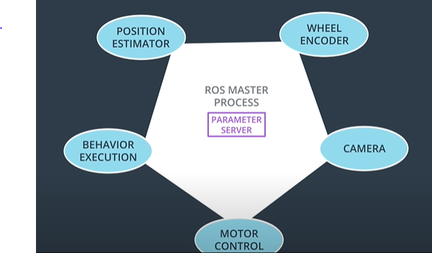

# ROS - The Robotic Operating System!

### PERCEPTION - DECISION MAKING - ACTUATION

ROS is an open-source software framework for robotics development. It is not an operating system in the typical sense. But like an OS, it provides a means of communicating with hardware. It also provides a way for different processes to communicate with one another via message passing. Lastly, ROS features a slick build and package management system called catkin, allowing you to develop and deploy software with ease. ROS also has tools for visualization, simulation, and analysis, as well as extensive community support and interfaces to numerous powerful software libraries.



### Installing ROS on a VM ware

```text
$ sudo apt-get install ros-kinetic-navigation
$ sudo apt-get install ros-kinetic-map-server
$ sudo apt-get install ros-kinetic-move-base
$ sudo apt-get install ros-kinetic-amcl
```

### ROS messages

ROS uses a simplified messages description language for describing the data values \(aka [messages](http://wiki.ros.org/Messages)\) that ROS [nodes](http://wiki.ros.org/Nodes) publish. This description makes it easy for ROS tools to automatically generate source code for the message type in several target languages. Message descriptions are stored in .msg files in the msg/ subdirectory of a ROS [package](http://wiki.ros.org/Packages).

Each ROS distribution comes with a variety of predefined messages. 

### ROS services 

Services allow the passing of messages between nodes

Doesn't have any publishers or subscribers

### Setting Up ROS ENV

Before we begin using ROS in a terminal, we must first ensure that all of the environment variables are present. To do this, we must source the setup script provided by ROS

```text
$ source /opt/ros/kinetic/setup.bash
```

### Starting the Master process <a id="starting-the-master-process"></a>

Before you can run any ROS nodes, you must start the Master process.

The Master process is responsible for the following \(and more\):

* Providing naming and registration services to other running nodes
* Tracking all publishers and subscribers
* Aggregating log messages generated by the nodes
* Facilitating connections between nodes

To run the master process, execute the command

```text
$ roscore
```


### Listing all Active Nodes <a id="listing-all-active-nodes"></a>

To get a list of all nodes that are active and have been registered with the ROS Master, we can use the command `rosnode list`. Let’s do so now:


 `/rosout`: This node is launched by roscore. It subscribes to the standard /rosout topic, the topic to which all nodes send log messages.

### Listing All Topics <a id="listing-all-topics"></a>

In a similar fashion, we are able to query the ROS Master for a list of all topics. To do so, we use the command `rostopic list`.


 `/rosout_agg`: Aggregated feed of messages published to /rosout.

### Get Information About a Specific Topic <a id="get-information-about-a-specific-topic"></a>

If we wish to get information about a specific topic, who is publishing to it, subscribed to it, or the type of message associated with it, we can use the command `rostopic info` 


### Show Message Information <a id="turtlesim-comms-show-message-information"></a>

Let’s get some more information about the `geometry_msgs/Twist` message on the `/turtle1/cmd_vel` topic, to do so, we will use the `rosmsg` info command.


Sometimes the message definition doesn’t provide an ample amount of detail about a message type. So we use `rosed`

```text
$ rosed [package_name] [filename]
```

### Echo Messages on a Topic <a id="turtlesim-comms-echo-messages-on-a-topic"></a>

Sometimes it may be useful to look at a topic’s published messages in real time. To do so, we can use the command `rostopic echo`.


 

