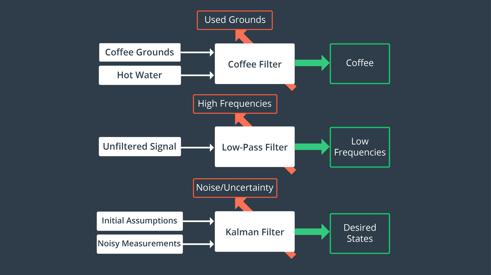
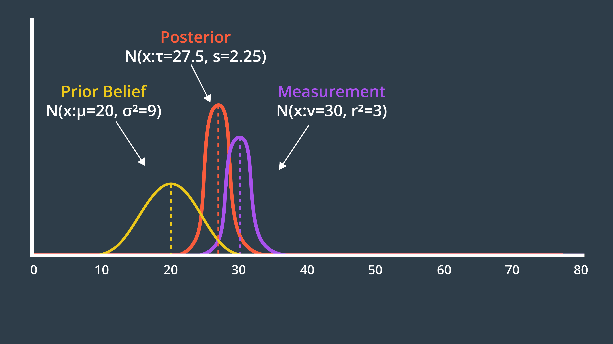

# Kalman filters

**Kalman filtering**, also known as **linear quadratic estimation** \(**LQE**\), is an algorithm that uses a series of measurements observed over time, containing statistical noise and other inaccuracies, and produces estimates of unknown variables that tend to be more accurate than those based on a single measurement alone, by estimating a joint probability distribution over the variables for each time frame.

This is the role of a Kalman Filter - after a movement or a measurement update, it outputs a unimodal Gaussian distribution. This is its best guess at the true value of a parameter. 

### There are exists three types of Kalman filters :

* KF :
  *  The first type is the Kalman Filter \(KF\) that was designed for linear systems. Therefore, for slip control, the KF needs linearization in operating point. 
* EKF: 
  * The second type is an Extended Kalman Filter \(EKF\) that was designed for nonlinear system estimation and filtration. The EKF requires the nonlinearity description. 
* UKF:
  *  The last type of the Kalman filter is an Unscented Kalman Filter \(UKF\). The UKF was designed for nonlinear function estimation and filtration. 
  * ref: [https://en.wikipedia.org/wiki/Kalman\_filter\#Unscented\_Kalman\_filter](https://en.wikipedia.org/wiki/Kalman_filter#Unscented_Kalman_filter)

A Gaussian distribution is a probability distribution, which is a continuous function. The probability that a random variable, x, will take a value between $$x_1$$ ​ and $$x_2$$ ​ is given by the integral of the function from $$x_1$$ ​ to ​ $$x_2$$ .

$$
p(x_1 < x < x_2) = \int_{x_1}^{x_2}f_x(x)dx
$$

### Mean and Variance 

A Gaussian is characterized by two parameters - its mean \(μ\) and its variance \(σ²\). The mean is the most probable occurrence and lies at the center of the function, and the variance relates to the width of the curve. The term uni-modal implies a single peak present in the distribution.

Gaussian distributions are frequently abbreviated as N\(x: μ, σ²\), and will be referred to in this way throughout the coming lessons.

**Variable Naming Conventions**

 $$\large x_t$$ : state

$$\large z_t$$: measurement

$$u_t$$ : control action 

### Mean and Variance Calculation

The new mean is a weighted sum of the prior belief and measurement means. With uncertainty, a larger number represents a more uncertain probability distribution. However, the new mean should be biased towards the measurement update, which has a smaller standard deviation than the prior.

$$
\large τ = \frac{r^2 \mu + \sigma^2 v}{r^2 + \sigma^2}
$$

The formula for the new variance is presented below.

$$
\large s^{2} = \frac{1}{\frac{1}{r^2} + \frac{1}{\sigma^2}}
$$

$$\mu$$ : Mean of the prior belief  
 $$\sigma^{2}$$ : Variance of the prior belief  
 $$v$$ : Mean of the measurement  
 $$r^{2}$$ : Variance of the measurement

$$τ$$ : Mean of the posterior  
 $$s^{2}$$ : Variance of the posterior

The two Gaussians provide us with more information together than either Gaussian offered alone. As a result, our new state estimate is more confident than our prior belief and our measurement. This means that it has a higher peak and is narrower. You can see this in the graph below. 

### State Prediction Formulas 

$$Posterior\ Mean \ \ \ \ \ \ \ \large \mu' = \mu_1 + \mu_2 $$ 

$$Posterior\ Variance \ \ \ \ \large \sigma^{2'} = \sigma^2_1 + \sigma^2_2$$ 

### Formulas for the Multivariate Gaussian 

#### Mean 

The mean is now a vector,

$$\large \mu = \left[ \begin{array}{c} \mu_{x} \\ \mu_{y} \end{array} \right]$$ 

#### Covariance 

And the multidimensional equivalent of variance is a covariance matrix,

$$\large \Sigma = \left[ \begin{array}{cc} \sigma_{x}^2 & \sigma_{x}\sigma_{y} \\ \sigma_{y}\sigma_{x} & \sigma_{y}^2 \end{array} \right]$$ 

Where $$\sigma_{x}^2$$ ​ and $$\sigma_{y}^2$$ ​ represent the variances, while $$ \sigma_{y}\sigma_{x} ​\ and \ \sigma_{x}\sigma_{y}$$ are correlation terms. These terms are non-zero if there is a correlation between the variance in one dimension and the variance in another. When that is the case, the Gaussian function looks 'skewed' when looked at from above.

If we were to evaluate this mathematically, the eigenvalues and eigenvectors of the covariance matrix describe the amount and direction of uncertainty.

#### Multivariate Gaussian 

Below is the formula for the multivariate Gaussian. Note that xx and \muμ are vectors, and \SigmaΣ is a matrix.

$$\large p(x) = \frac{1}{(2\pi)^{\frac{D}{2}}|\Sigma|^\frac{1}{2}}e^{-\frac{1}{2}(x-\mu)^T\Sigma^{-1}(x-\mu)}$$ 

If D=1, the formula simplifies to the formula for the one-dimensional Gaussian that you have seen before.

## Kalman Filter Equations

These are the equations that implement the Kalman Filter in multiple dimensions.

### State Prediction:

$$
\large x' = Fx
$$

$$
P' = FPF^T + Q
$$

### Measurement Update:

$$
\large y = z - Hx'
$$

$$
S = HP'H^T + R
$$

### Calculation of Kalman Gain:

$$
K = P'H^TS^{-1}
$$

### Calculation of Posterior State and Covariance:

$$
\large x = x' + Ky
$$

$$
P = (I - KH)P'
$$

The Kalman Filter can successfully recover from inaccurate initial estimates, but it is very important to estimate the noise parameters, Q and R, as accurately as possible - as they are used to determine which of the estimate or the measurement to believe more.

## Intro to Extensive KF

The Kalman Filter is applicable to problems with linear motion and measurement functions. This is limiting, as much of the real world is nonlinear.

A nonlinear function can be used to update the mean of a function,

$$
\mu \xrightarrow{f(x)} \mu'
$$

but not the variance, as this would result in a non-Gaussian distribution which is _much_ more computationally expensive to work with. To update the variance, the Extended Kalman Filter linearizes the nonlinear function f\(x\) over a small section and calls it F. This linearization, F, is then used to update the state's variance.

$$
P \xrightarrow{F} P'
$$

The linear approximation can be obtained by using the first two terms of the Taylor Series of the function centered around the mean.

$$
F = f(\mu) + \frac{\delta f(\mu)}{\delta x}(x-\mu)
$$

### Extended Kalman Filter Equations 

These are the equations that implement the Extended Kalman Filter - you'll notice that most of them remain the same, with a few changes highlighted in red.

State Prediction:

$$
\large \color{red} \cancel{x' = Fx} \quad \color{black} \rightarrow \quad x' = f(x)
$$

$$
\large \color{black} P' = \color{blue}F\color{black}P\color{blue}F^T\color{black} + Q
$$

Measurement Update:

$$
\large \color{red} \cancel{y = z - Hx'}\quad \color{black} \rightarrow \quad y = z -h(x')
$$

$$
\large \color{black} S = \color{blue}H\color{black}P' \color{blue}H^T\color{black} + R
$$

Calculation of Kalman Gain:

$$
\large \color{black} K = P' \color{blue}H^T\color{black}S^{-1}
$$

Calculation of Posterior State and Covariance:

$$
\large \color{black} x = x' + Ky
$$

$$
\large \color{black} P = (I - K \color{blue}H\color{black})P'
$$

Highlighted in blue are the Jacobians that replaced the measurement and state transition functions.

The Extended Kalman Filter requires us to calculate the Jacobian of a nonlinear function as part of every single iteration, since the mean \(which is the point that we linearize about\) is updated.

    

