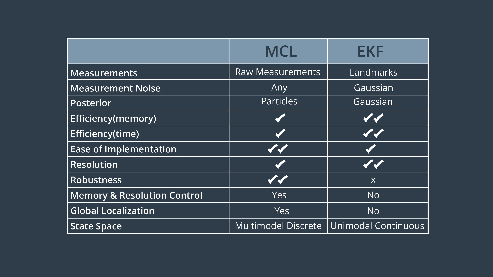

# Monte Carlo Localization

**Monte Carlo localization \(MCL\)**, also known as **particle filter localization**, is an algorithm for robots to localize using a particle filter. Given a map of the environment, the algorithm estimates the position and orientation of a robot as it moves and senses the environment. The algorithm uses a particle filter to represent the distribution of likely states, with each particle representing a possible state, i.e., a hypothesis of where the robot is.

### MCL VS EKF

