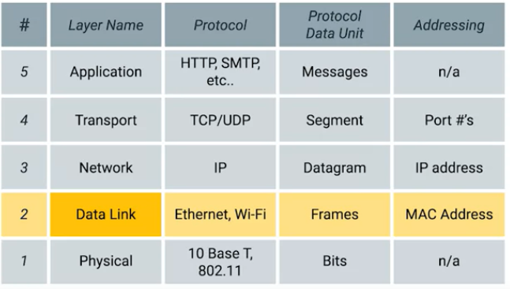
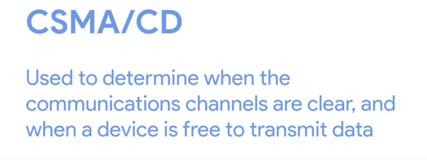
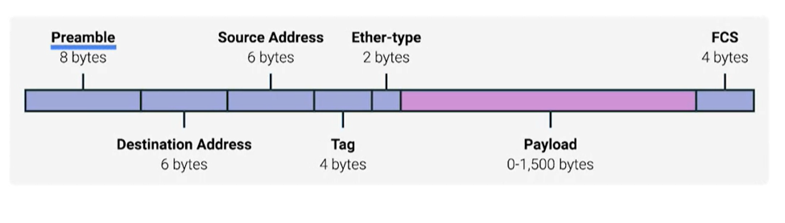
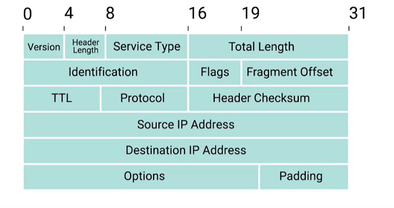
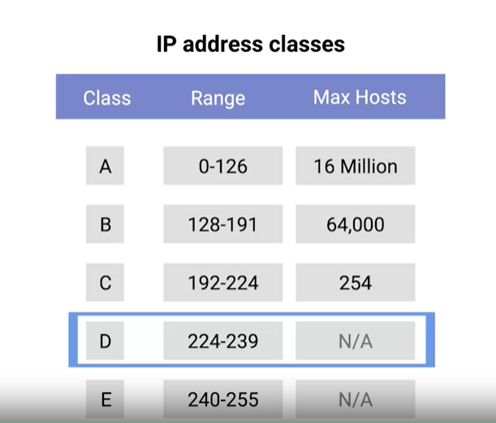

# Networking

Layers of Computer Networking:

## Physical layer:

Copper or Optical fiber cables

Duplex communication system

RJ45 plug  - most common

## Data link Layer

Ethernet protocol CSMA/CD is used to prevent collisions

Mac Address or Media Access Controll address to identify which node the communication is meant for. 

MAC address is a 48 bit hexadecimal number \(Six Grouping\)

### In a MAC address the first three octets are OUI \(organizational Unique Identifier\). Its used to Identify the manufacturer. Its provided by IEEE. 

The last 3 octets are assigned by the man.fac randomly and uniquely

### UNICAST

unicast is for recieving only from one address

and if the least significant bit is set to one, the ethernet frame is only meant for multicast frame. 

### Ethernet Frame

### CRC

A CRC is basically a mathematical transformation that uses polynomial division to create a number that represents a larger set of data. Anytime you perform a CRC against a set of data, you should end up with the same checksum number. The reason it's included in the Ethernet frame is so that the receiving network interface can infer if it received uncorrupted data.

## NETWORKING LAYER

IP addressess help in sending data to specific networks

The most common form of IP is the IPV4

The IP address is only 32 bits or 4 bytes

IP datagram:

The two primary sections of an IP datagram are the header and the payload. IP datagram header contains a lot more data than an Ethernet frame header does.

**Encapsulation:** The entire contents of an IP datagram are encapsulated as the payload of an Ethernet frame. You might have picked up on the fact that our IP datagram also has a payload section. The contents of this payload are the entirety of a TCP or UDP packet

The **address class system** is a way of defining how the global IP address space is split up.

There are three primary types of address classes, Class A, class B, and class C: 

* Class A addresses are those where the first octet is used for the network ID, and the last three are used for the host ID. 
* Class B addresses are where the first two octets are used for the network ID, and the second two, are used for the host ID.
*  Class C addresses are those where the first three octets are used for the network ID, and only the final octet is used for the host ID.

Tip: If the very first bit of an IP address is a zero, it belongs to a class A network, if the first bits are one, zero, it belongs to a class B network. Finally, if the first bits are 110, it belongs to a class C network.

Nowadays the class adress system is being replaced by CIDR\(classless Inter Domain System\)

ARP is a protocol used to discover the hardware address of a node with a certain IP address.ARP table is just a list of IP addresses and the MAC addresses associated with them. ARP table entries generally expire after a short amount of time to ensure changes in the network are accounted for.

### Subnetting

subnetting is the process of taking a large network and splitting it up into many individual smaller subnetworks or subnets.

